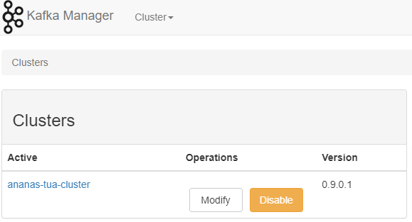
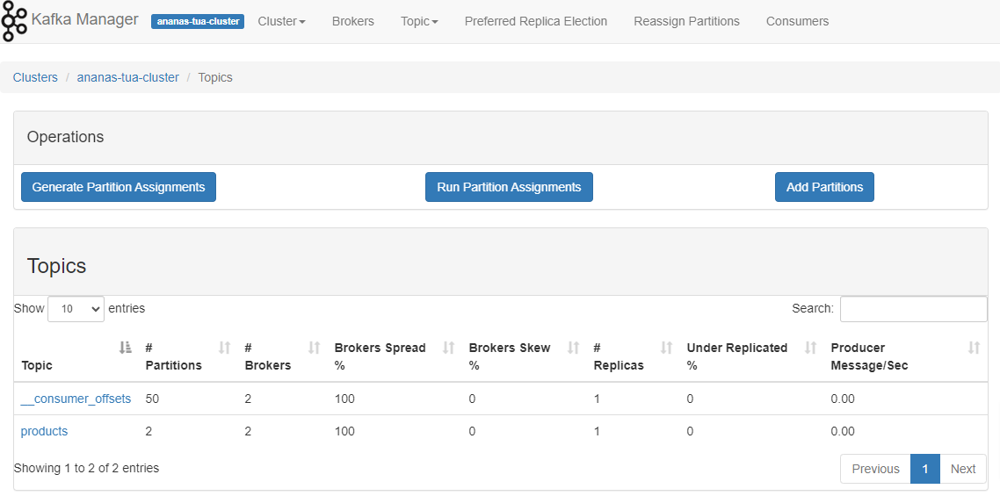
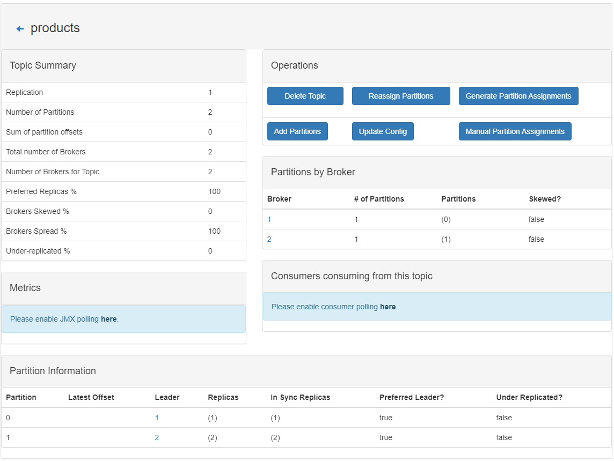

# Tracking User Activities v1.0

This PoC-based project demonstrates business requirements that will allow me to track unusual user activities for specific business cases and take actions based on those activities (e.g., sending emails, sending chat notifications, suspending users, etc.*).

## Problem

Working on an e-commerce platform serving a large customer base and often offering gifts or vouchers based on order limits or through raffles can present significant challenges. One of the major challenges lies in dealing with users who attempt to exploit the system in various ways to gain unauthorized access to these benefits.

To address this issue effectively, it becomes crucial to monitor user behaviors closely. By analyzing specific patterns, we take proactive measures to notify relevant parties about suspicious activities and remain vigilant in preventing and predicting such unauthorized actions.

## Solution

One of our infrastructure pieces is Kafka, which can initially help monitor user behaviors.

To track users' activities in an e-commerce app and send or show alerts when certain cases happen, you can use Spring Boot and Kafka in the following steps:

1. **Define the events that you want to track**: Determine the events that you want to track, such as user logins, product searches, purchases, and other actions that are relevant to your e-commerce app.
2. **Create Kafka topics**: Create topics for each event you want to track. Each topic should have a unique name and be configured with appropriate settings, such as partitioning and replication.
3. **Implement event producers**: In your Spring Boot application, implement event producers that publish events to the corresponding Kafka topics when the relevant actions occur. Use the Kafka producer API to create and send messages to the Kafka topics.
4. **Implement event consumers**: Implement event consumers that listen to the Kafka topics and perform the necessary actions when certain events occur. For example, you can implement an email notification service that alerts users when they add a product to their cart but only complete the purchase within a specified time.
5. **Configure Kafka consumer groups**: Configure Kafka consumer groups to manage the consumption of events from Kafka topics. This ensures that multiple instances of the same service can consume events without duplicating work or processing the same event multiple times.
6. **Monitor and manage Kafka**: Monitor and manage Kafka to ensure that the system functions properly and that events are processed correctly.

Following these steps, we can track user activities in our e-commerce app and send or show alerts when certain business cases happen using Spring Boot and Kafka.

---

### Business Usecase

A suggested business use case is to track user behavior as the following:

1. The customer buys a product.
2. If many customers try to buy the same product repeatedly in a short period, alert the support team by email, message, etc.
3. For example, the window could be 5 seconds, and the product count could be more than ten products.

### Technical Solution

#### Tools

1. Java 21 JDK.
2. Spring Boot 3.1.0.
3. Docker Desktop latest.

#### Project Structure

The configuration file shows a Zookeeper server used to monitor our Kafka. In this setup, we will start a Zookeeper server, 2 Kafka nodes, and a Kafka manager:

* So in `docker-compose.yml` file we have 4 services, namely *zookeeper* and *kafka-server-1*, *kafka-server-2*, *kafka-manager*.
* Make the **Zookeeper** server always start before 2 Kafka servers, and the Kafka manager is triggered to start or stop. So in the config, we have a setup `depends_on` to this dependency.
* **Zookeeper** server listens on port 2181 to manage our Kafka servers. We defined this within the same container setup, and any client running on the host will be run on port 22181. So, in the zookeeper's config, we will expose port *22181:2181*.
* With two nodes of Kafka servers, we will expose the host application with ports **29092** & **39092**. However, our Kafka is advertised on port 9092, configured in the environment `KAFKA_ADVERTISED_LISTENERS`.
* Service names and `KAFKA_BROKER_ID` are unique across the services.
* The Kafka manager runs on port 9000.

#### Configure Project

* As we are using `docker compose` to start the services, we will use the following command:

  ```bash
  $ docker compose up -d

   Network tracking-user-activities_default             Created
   Container tracking-user-activities-zookeeper-1       Started
   Container tracking-user-activities-kafka-manager-1   Started
   Container tracking-user-activities-kafka-server-1-1  Started
   Container tracking-user-activities-kafka-server-2-1  Started
  ```
* Use the `docker compose` command to grep the logs of our services to ensure the service is active and has no exception when it started:

  ```bash
  $ $ docker compose logs zookeeper | grep -i started

  tracking-user-activities-zookeeper-1  | [2023-05-30 10:23:48,313] INFO Started o.e.j.s.ServletContextHandler@126253fd{/,null,AVAILABLE} (org.eclipse.jetty.server.handler.ContextHandler)
  tracking-user-activities-zookeeper-1  | [2023-05-30 10:23:48,326] INFO Started ServerConnector@268f106e{HTTP/1.1, (http/1.1)}{0.0.0.0:8080} (org.eclipse.jetty.server.AbstractConnector)
  tracking-user-activities-zookeeper-1  | [2023-05-30 10:23:48,326] INFO Started @621ms (org.eclipse.jetty.server.Server)
  tracking-user-activities-zookeeper-1  | [2023-05-30 10:23:48,326] INFO Started AdminServer on address 0.0.0.0, port 8080 and command URL /commands (org.apache.zookeeper.server.admin.JettyAdminServer)
  tracking-user-activities-zookeeper-1  | [2023-05-30 10:23:48,360] INFO PrepRequestProcessor (sid:0) started, reconfigEnabled=false (org.apache.zookeeper.server.PrepRequestProcessor)

  $ docker compose logs kafka-server-1 | grep -i started
  tracking-user-activities-kafka-server-1-1  | [2023-05-30 10:23:53,223] INFO [KafkaServer id=1] started (kafka.server.KafkaServer)
  ```
* Goto kafka-manager [http://localhost:9000/](http://localhost:9000/) and do the following steps to see the entire cluster:

  * Click on Cluster and choose Add Cluster with the following parameters:

    * Cluster Name: any name you choose, for ex., `ananas-tua-cluster`.
    * Cluster Zookeeper Hosts: `zookeeper:2181`.
  * Then scroll down and press the `save` button to save the configurations, and you should see this page:

    
  * Then click '**Go to cluster view**' and explore your cluster.
* Use the following docker-compose command `docker compose down` to shut down the cluster.
* To create a topic with two partitions and two replicas, go to kafka-manager [http://localhost:9000/](http://localhost:9000/) again and do the following steps:

  * Click on view active cluster with name **ananas-tua-cluster**
  * From the upper menu, click on `topic` -> `create` with the following parameters:
    * Topic: `products-topic`
    * Partitions: `2`
    * Replication Factor: `2`
    * Click `create`.
    * Then click on `Go to topic view,` and you should see the following screen:

      

##### Create a Kafka topic programmatically

We can easily create topics programmatically with `AdminClient` in Spring-Kafka. In this demo, I’ll create a new topic, `products` with `KafkaAdmin` as the following code:

```java
@Configuration
public class KafkaTopicConfig {

    @Value(value = "${kafka.bootstrapAddress}")
    private String bootstrapAddress;

    @Value(value = "${kafka.topic.name}")
    private String topicName;
    @Value(value = "${kafka.topic.partitions}")
    private int partitions;

    @Value(value = "${kafka.topic.replicas}")
    private short replicas;

    @Bean
    public KafkaAdmin kafkaAdmin() {
        return new KafkaAdmin(Map.of(
                AdminClientConfig.BOOTSTRAP_SERVERS_CONFIG,
                this.bootstrapAddress));
    }

    @Bean
    public NewTopic createNewProductTopic() {
        return new NewTopic(this.topicName, this.partitions, this.replicas);
    }
}
```

After starting the application, the configuration will be run automatically. If the topic doesn’t exist, Kafka Admin will create a new one in Kafka manager. We can see that our topic is created as in the previous picture. In the Kafka manager, we can see that our topic is created:



#### Demo the Project

* Check out the project and cd to the current application.
* Start the Spring boot application.
* Trigger API add product using this script `curl/test-add-product.sh` as the `$ ./curl/test-add-product.sh`
* In the Application log, you should see something like this:

```bash
2023-06-14T11:37:56.967+02:00  WARN 17608 --- [ntainer#0-0-C-1] c.siriusxi.tua.service.ProductListener   : ALERT!: Product 'Nokia' has been ordered more than threshold 20; 26 times within the last 5 seconds!
2023-06-14T11:37:57.037+02:00  INFO 17608 --- [nio-8080-exec-9] c.s.t.api.controller.ProductController   : [ProductController]: add new product = Product[id=100, name=iPad, price=153.94]
2023-06-14T11:37:57.037+02:00  INFO 17608 --- [nio-8080-exec-9] c.siriusxi.tua.service.ProductService    : [ProductService] send product ProductMessage[product=Product[id=100, name=iPad, price=153.94], action=add] to topic.
2023-06-14T11:37:57.042+02:00  INFO 17608 --- [ad | producer-1] c.s.tua.infra.kafka.ProductProducer      : Successfully sent message = [ProductMessage[product=Product[id=100, name=iPad, price=153.94], action=add]] with offset = [610]
2023-06-14T11:37:57.045+02:00  INFO 17608 --- [ntainer#0-0-C-1] c.siriusxi.tua.service.ProductListener   : [ProductListener] Get request from product topic [ProductMessage[product=Product[id=100, name=iPad, price=153.94], action=add]] with action add
2023-06-14T11:37:57.045+02:00  WARN 17608 --- [ntainer#0-0-C-1] c.siriusxi.tua.service.ProductListener   : ALERT!: Product 'iPad' has been ordered more than threshold 20; 23 times within the last 5 seconds!
```

Didn't you notice anything in the output log? Yes, the system has alerted me that suspicious purchase activities have occurred on Nokia and iPad products within the last 5 seconds, so please check.
